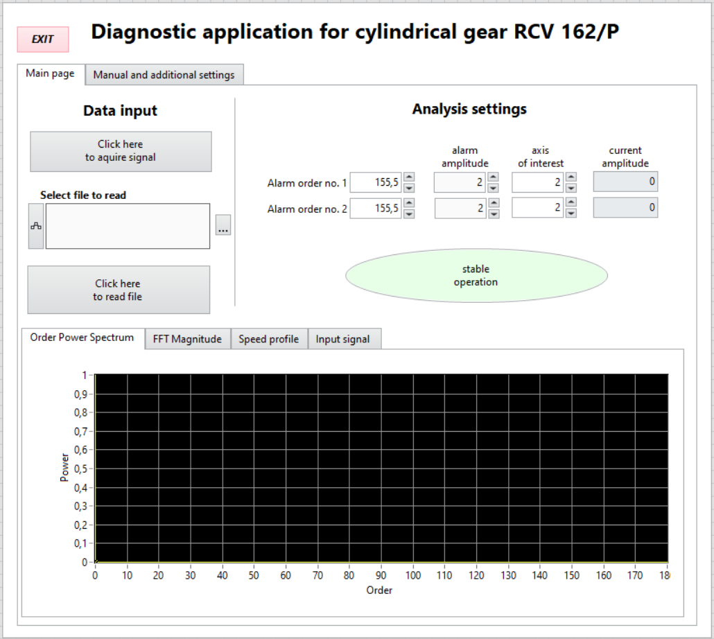
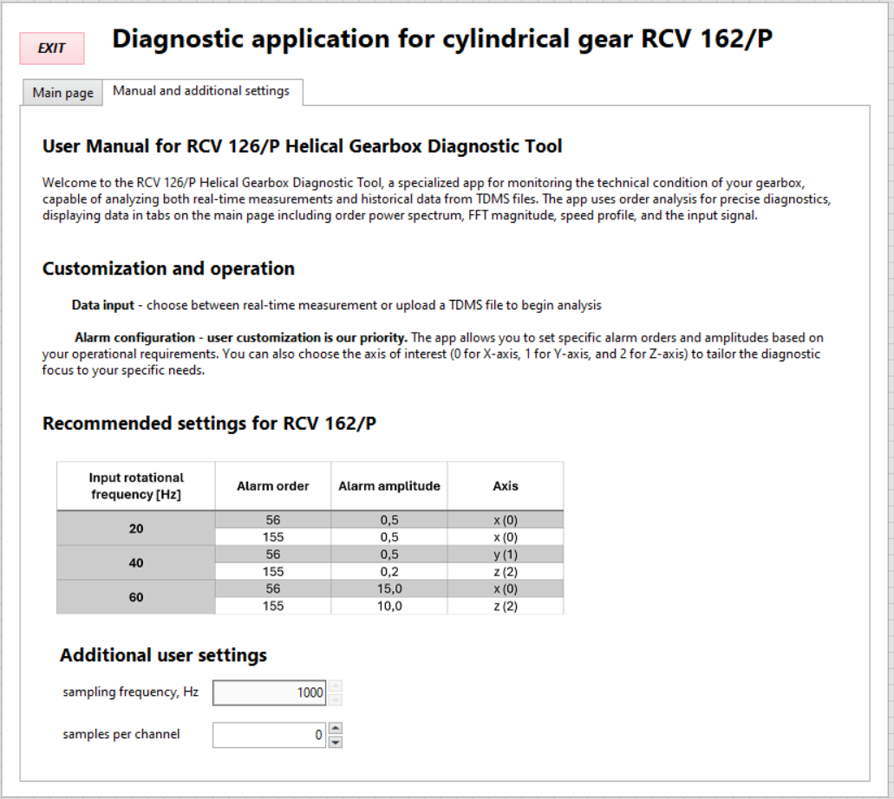

# Diagnostic Application for Cylindrical Gear RCV 162/P

## Overview

This LabVIEW project is a diagnostic application designed for monitoring the technical condition of cylindrical gear RCV 162/P. The application provides functionalities for both real-time data acquisition and analysis of historical data from TDMS files. The primary features include order power spectrum analysis, FFT magnitude analysis, speed profile visualization, and input signal monitoring. The project has been created in Labview 2023 Q3.

## Features

### Main Interface
- **Data Input**: Options to acquire real-time signals or read from files.
- **Analysis Settings**: Customize alarm settings for specific orders, amplitudes, and axes of interest.
- **Operation Status**: Displays the current status of the gear operation (e.g., stable operation/damaga alarm).

### Analysis Tools
- **Order Power Spectrum**: Visualize the power spectrum of the orders.
- **FFT Magnitude**: Analyze the FFT magnitude for frequency components.
- **Speed Profile**: Monitor the speed profile over time.
- **Input Signal**: Display the raw input signal for diagnostic purposes.

## User Manual and Settings
The application includes a detailed user manual explaining how to use the tool effectively:
- **Customization and Operation**: Instructions on data input methods and alarm configuration.
- **Recommended Settings**: Preset configurations for different operational conditions based on input rotational frequency.
- **Additional User Settings**: Options to set sampling frequency and samples per channel for data acquisition.

## LabVIEW information
The project is developed using LabVIEW, using **parallel loops**, communicating through **queues**. Used techniques include: 
- **State Machine design pattern** 
- **Separate ACQ, Read, UI and ANALYSIS loops**
- **Functional Global Variable**: ensures smooth communication with the UI

## Screenshots

---

